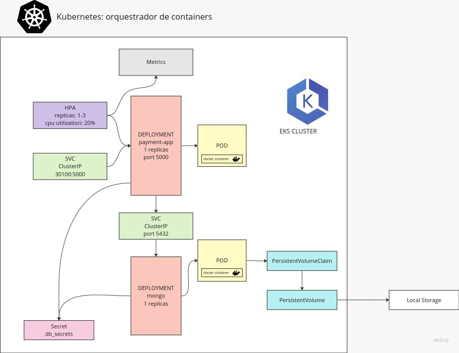
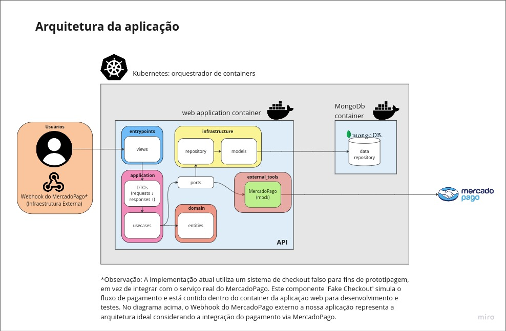

## Sistema de criação e gerenciamento de pedidos realizado para o Tech Challenge FIAP - SOAT - Grupo 31

Miro: https://miro.com/app/board/uXjVNe56-bI=/?share_link_id=839163216515<br>
Postman: https://documenter.getpostman.com/view/28694171/2s9YRCXrYf<br>
Video: 

# Arquitetura da Aplicação

## Arquitetura Kubernetes



## Arquitetura Código



1 - Usuário faz uma requisição: Um usuário interage com a aplicação fazendo uma requisição.

2 - Adapters / Entrypoints: A requisição atinge os entrypoints da API, que são os controladores (*_views.py), que interpretam os dados da requisição.

3 - Aplicação / DTOs: Os dados da requisição são então mapeados para Data Transfer Objects (DTOs), que são objetos usados para transferir dados entre processos. No caso, poderiam ser as classes em requests ou responses.
Aplicação / Caso de Uso: Os DTOs são passados para a lógica de negócios da aplicação, representada pelos casos de uso (*_usecase.py). Aqui, a requisição é processada de acordo com as regras de negócio.

4 - Domínio / Entidades: Os casos de uso operam em entidades do domínio (client.py, order.py, payment.py, product.py), que são as representações de negócio puras e contêm a lógica de negócios fundamental.

5 - Portas / Ports: Em seguida, os casos de uso interagem com os ports (*_port.py), que abstraem a comunicação com os adaptadores de infraestrutura externa.

6 - Infraestrutura / Repositórios: Por meio dos ports, os casos de uso interagem com os repositórios na camada de infraestrutura (*_repository.py). Estes repositórios abstraem a lógica de acessar o repositório de dados.

7 - Infraestrutura / Modelos de Banco de Dados: Os repositórios manipulam modelos de banco de dados (*_model.py) que são mapeamentos de entidades do domínio para tabelas de database.

Retorno da Requisição: Depois que a lógica de negócios é processada e os dados são persistidos ou atualizados conforme necessário, os resultados são então mapeados de volta para DTOs e enviados de volta pelos ports e adapters para a interface de usuário ou cliente

Optamos pelo padrão SAGA coreografado por várias razões que se alinham com as necessidades e a arquitetura do nosso sistema. Em primeiro lugar, a complexidade da comunicação entre nossos serviços não é alta. Especificamente, a interação necessária é apenas entre os microsserviços de Orders e Payment, tornando desnecessário o overhead associado a um padrão SAGA orquestrado.

Vantagens do Padrão Coreografado:

1 - Simplicidade na Implementação: Como nossos casos de uso não exigem interações complexas, o padrão coreografado oferece uma abordagem mais simples e direta. Cada serviço apenas precisa emitir eventos e reagir a eventos relevantes, sem a necessidade de um coordenador central para gerenciar a lógica da saga.
2 - Desacoplamento de Serviços: Esse padrão promove um maior desacoplamento entre os serviços. Como cada microserviço é responsável por sua própria lógica de compensação, a implementação se torna mais modular e menos dependente de um único ponto de falha ou coordenação.
3 - Facilidade de Escalabilidade: Serviços desacoplados podem ser escalados independentemente. Isso é especialmente vantajoso em arquiteturas de microsserviços, onde diferentes serviços podem ter requisitos de escalabilidade diferentes.
4 - Redução de Dependências: Sem a necessidade de um orquestrador central, reduzimos as dependências e a complexidade operacional. Isso também simplifica o processo de deploy e manutenção dos serviços.

Contexto Específico:

No nosso cenário, os serviços de Orders e Payment precisam se comunicar de forma a garantir consistência nas transações, mas essa comunicação é direta e não requer coordenação complexa. O padrão coreografado permite que cada serviço gerencie sua própria lógica de negócios e compensação de forma autônoma, resultando em uma arquitetura mais ágil e menos propensa a erros devido a pontos únicos de falha.
Portanto, ao escolhermos o padrão SAGA coreografado, garantimos uma solução que é ao mesmo tempo eficaz e eficiente para a nossa necessidade, maximizando a simplicidade sem sacrificar a robustez da comunicação entre os serviços.


*Observação: A implementação atual utiliza um sistema de fake checkout em vez de integrar com o serviço real do MercadoPago. O componente 'Fake Checkout' simula o fluxo de pagamento e está contido dentro do container da aplicação web para desenvolvimento e testes. 

# Guia Rápido para Executar a Aplicação Flask
Este guia rápido descreve como configurar e executar a aplicação Flask usando Docker Compose e migrações de banco de dados.

## Opção 1: Inicie o Ambiente com o Docker Compose
Certifique-se de ter o Docker Compose instalado em sua máquina. Se não o tiver, instale-o.
No diretório raiz do projeto, execute o seguinte comando para iniciar o ambiente:
```
docker compose up --build -V
```
Isso criará e iniciará os contêineres necessários para a aplicação.
Acesse o serviço pela url [http://localhost:5000](http://localhost:5000)


## Opção 2: Inicie o Ambiente com kubernetes
Primeiramente instale o `kubectl` para manipular o cluster kubernetes, de acordo com a [documentação oficial](https://kubernetes.io/docs/tasks/tools/#kubectl).

Agora é necessário utilizar um cluster local para executar o ambiente. Existem diversos clusters que podem ser utilizados, porém recomendamos a utilização do minikube. Instale-o conforme a [documentação](https://minikube.sigs.k8s.io/docs/start/). Para a instalação do minikube é importante ter o [Docker](https://docs.docker.com/) instalado em sua máquina.
Após a instalação do minikube, inicie o cluster com:

```
minikube start
```

No diretório raiz do projeto, execute o comando:
```
kubectl apply -f kubernetes
```

Esse comando criárá todos os recursos necessários para que a aplicação rode corretamente no clustes.

Espere até que todos os pods da aplicação estejam prontos (para acompanhar os pods subindo, execute `kubectl get pods --watch`)

Após os pods estarem prontos, para acessar a aplicação execute:

```
minikube service svcfiaptechchallenge 
```

ou direcione a porta da aplicação no cluster para o seu host local, com:

```
kubectl port-forward service/svcfiaptechchallenge 5000:80
```

e acesse o serviço pela url [http://localhost:5000](http://localhost:5000)

# Coverage Testes

